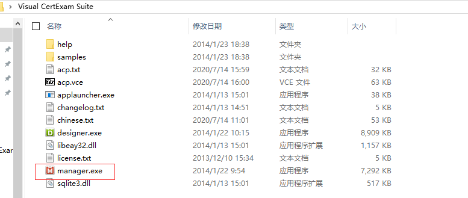
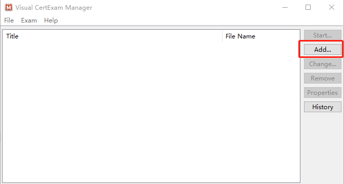
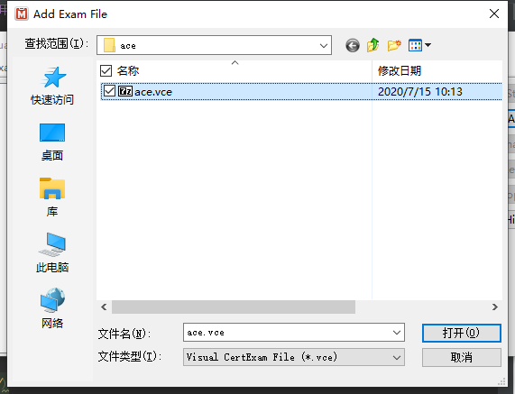
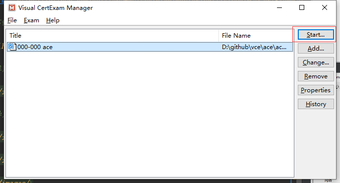
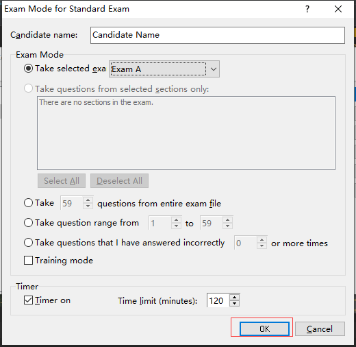
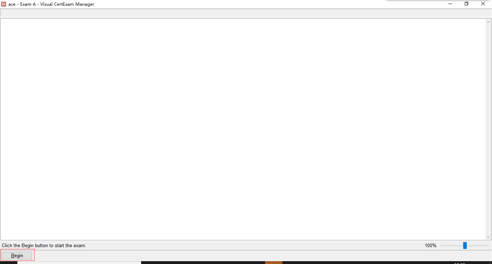
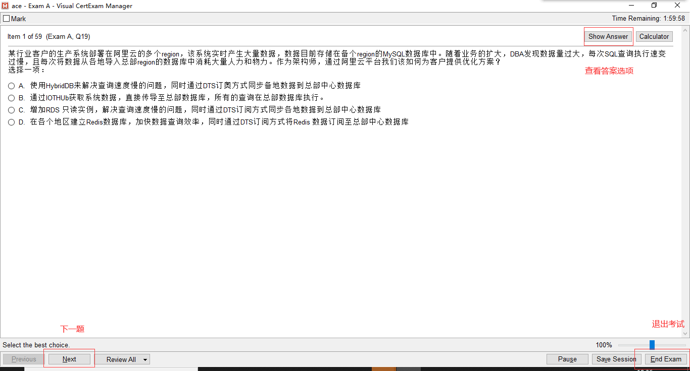

## 版权说明

该项目仅为学习交流之用，请勿用于商业用途！！！

涉及相关文件，请勿外传，违者后果自负。

## 考试系统使用方式

> 1.下载考试系统

[vcs下载](https://github.com/weiliang-ms/vce/blob/master/soft/Visual%20CertExam%20Suite.zip)

> 2.下载对应题库

[ace](https://github.com/weiliang-ms/vce/blob/master/ace/ace.vce)

> 3.解压运行vcs

> 4.导入题库

